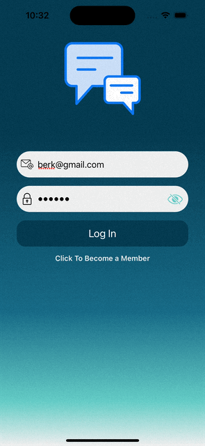

## Genel Bakış

Chat uygulaması, kullanıcıların anlık mesajlaşmasını sağlar. Kullanıcılar, mesajlar gönderebilir, alabilir ve görüntüleyebilir.

## Temel Özellikler

- Kullanıcıların oturum açabilmesi ve kayıt olabilmesi.
- Kullanıcıların diğer kullanıcılarla iletişim kurabilmesi.
- Anlık mesajlaşma özelliği.
- Mesajların gönderilme saatini gösterme.

## Kullanım

Uygulama, kullanıcıların kayıt olmasını ve oturum açmasını gerektirir. Oturum açan kullanıcılar, diğer kullanıcılarla sohbet başlatabilir ve mesajlar gönderebilir.

# Chat Uygulaması: Bir İlk Deneyim

Bu projede, ilk defa storyboard kullanmadan geliştirdiğim bir chat uygulamasını sunuyorum. MVVM mimarisini kullanarak, kodların düzenli ve bakımı daha kolay olmasına özen gösterdim. Aynı zamanda, yazdığım kodlara anlamlı yorum satırları ekleyerek, kodun anlaşılabilirliğini artırmaya çalıştım. Bu projeye başlarken bir eğitim kaynağından ilham aldım, ancak zamanla kendi fikirlerimi ve özelliklerimi ekleyerek bu deneyimi kişiselleştirdim.

Firebase'in sunduğu hizmetlerden yararlanarak, uygulamada temel işlevleri oluşturdum. Firestore, Firebase Storage ve Authentication entegrasyonları sayesinde kullanıcılar anlık mesajlar gönderebilir, medya dosyalarını(profil fotoğrafı) yükleyip paylaşabilir ve uygulamaya kayıt olarak sohbetlere katılabilirler. Firebase'in bu hizmetleri uygulamanın arkasındaki güçlü altyapıyı oluştururken, ben de uygulamada temiz kodlama prensiplerini uygulamaya çalışarak geliştirmeler yaptım.
# Çoklu Dil Desteği

Bu chat uygulaması, kullanıcıların cihazlarının diline otomatik olarak uyum sağlayacak şekilde çoklu dil desteği sunmaktadır. Uygulama, kullanıcının cihaz dilini algılar ve otomatik olarak bu dilde çalışır. Örneğin, cihaz Türkçe dilinde ise uygulama Türkçe olarak görüntülenir. Aynı şekilde, cihaz İngilizce dilindeyken uygulama İngilizce olarak çalışır.

Bu özellik, kullanıcı deneyimini kişiselleştirmeye yardımcı olur ve uygulamanın daha erişilebilir olmasını sağlar.
# Uygulama Görüntüleri

